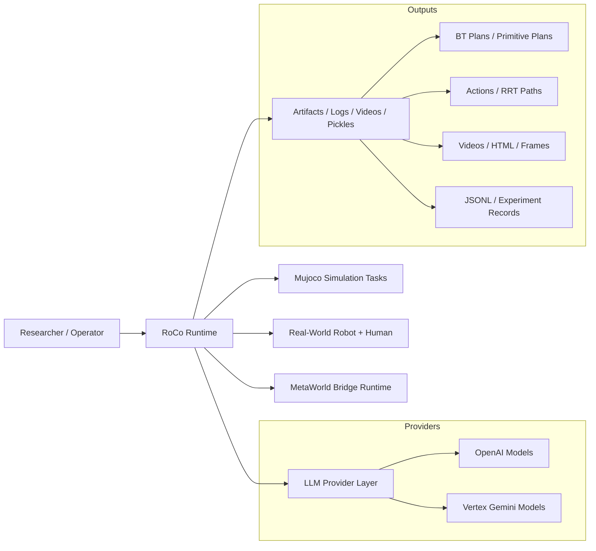
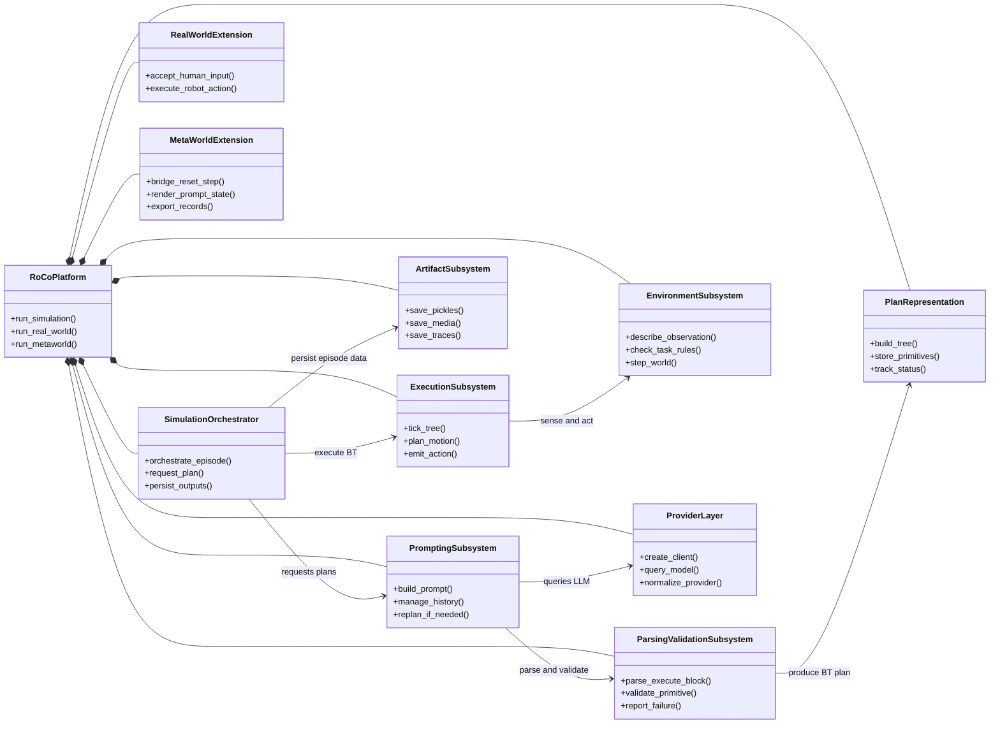
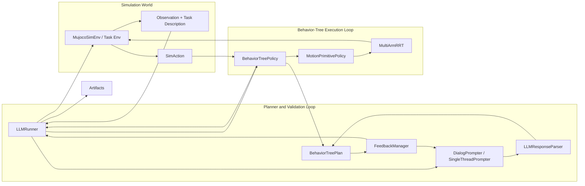
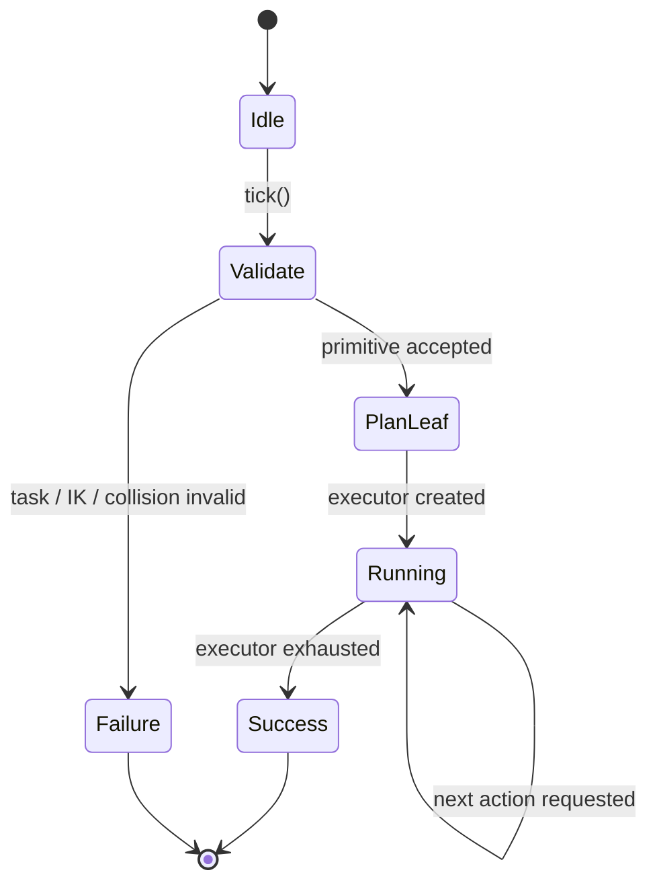
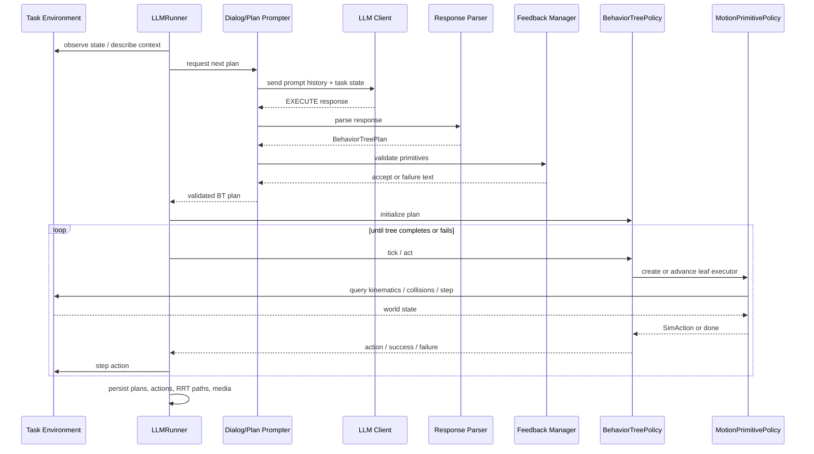
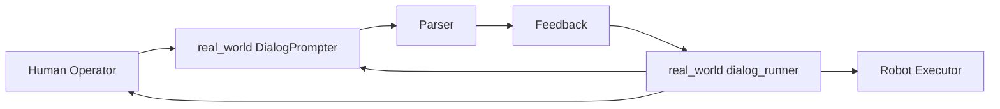
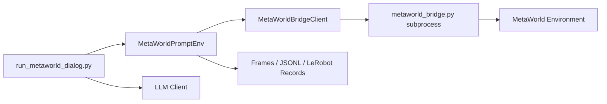

# RoCo System Architecture

This document describes the current architecture of the RoCo codebase on the `feature/behavior-tree-integration` branch. It focuses on how multi-agent prompting, parsing, validation, behavior-tree execution, environment control, and experiment logging fit together across the simulation, real-world, and MetaWorld paths.

Note on notation: the figures below use Mermaid so they render in standard Markdown viewers. Mermaid does not natively support SysML, so the BDD and IBD figures are presented as BDD-style and IBD-style architecture views.

## 1. Scope and Intent

RoCo is a research system for dialectic multi-robot collaboration. In this branch, the execution layer is being refactored from a flat primitive plan representation into a Behavior Tree (BT) execution architecture so that plan validation, execution, and future recovery behaviors can be made more interruptible and responsive.

The architecture currently spans three closely related runtime variants:

- Mujoco-based RoCo simulation for benchmark tasks such as packing, sweeping, and rope manipulation.
- A real-world runner with robot and human dialogue for the `blockincup` setup.
- A MetaWorld integration path that uses a bridge subprocess and direct action control.

## 2. System Context

Figure 1. System context across the main runtime variants.

## 3. Architectural Drivers

The current design is shaped by five primary concerns:

- Multi-agent coordination: the planner must represent synchronized robot actions and dialogue-mediated consensus.
- Execution validity: plans must be filtered through task constraints, IK checks, collision checks, and reachability checks before execution.
- Runtime responsiveness: the BT layer should support higher-frequency execution control than the LLM planner loop.
- Research traceability: each episode persists prompts, plans, paths, actions, and visual outputs for analysis.
- Provider portability: the same prompting stack can target OpenAI or Gemini backends through a common client interface.

## 4. BDD-Style Logical Decomposition

Figure 2. BDD-style view of the major RoCo blocks and their composition relationships.

### 4.1 Block Catalog

| Block | Key files | Responsibility |
| --- | --- | --- |
| Simulation Orchestrator | `run_dialog.py` | Owns the episode loop, environment resets, prompting, BT construction, execution, and artifact persistence for simulation tasks. |
| Prompting Subsystem | `prompting/dialog_prompter.py`, `prompting/plan_prompter.py` | Conducts multi-agent or single-thread planning conversations, maintains chat history, and triggers replanning. |
| Parsing and Validation | `prompting/parser.py`, `prompting/feedback.py` | Converts LLM output into synchronized motion primitives and rejects infeasible or task-invalid plans. |
| Plan Representation | `rocobench/behavior_tree.py` | Defines BT nodes, execution status, shared execution context, and the `BehaviorTreePlan` container. |
| Execution Subsystem | `rocobench/policy.py` | Ticks the BT, instantiates primitive executors, performs motion planning, and emits `SimAction`s. |
| Environment Subsystem | `rocobench/envs/base_env.py`, `rocobench/envs/task_*.py` | Supplies observations, task context, robot state, action prompts, and task-specific semantic checks. |
| Provider Layer | `llm_api.py` | Provides a model-agnostic interface for OpenAI and Gemini-family models, including bridge-based fallbacks. |
| Real-World Extension | `real_world/runners/dialog_runner.py`, `real_world/prompts/dialog_prompter.py` | Supports a mixed robot/human execution flow where only robot actions are executed automatically. |
| MetaWorld Extension | `run_metaworld_dialog.py`, `metaworld_integration/*` | Supports direct-action collection in MetaWorld through a subprocess bridge and textual prompt wrapper. |
| Artifact Subsystem | outputs under `data/`, `*.pkl`, videos, HTML, JSONL | Preserves experiment state for debugging, evaluation, replay, and dataset generation. |

## 5. IBD-Style Internal Architecture for the Simulation Path

Figure 3. IBD-style view of the primary runtime interactions for `run_dialog.py`.

### 5.1 Control Semantics

The simulation path is intentionally split into two control loops with different time scales:

- A low-frequency planner loop that gathers textual state, prompts the LLM, parses the reply, and validates the resulting plan.
- A higher-frequency execution loop that ticks the BT, expands leaf motion primitives into motion plans, and streams simulator actions until the tree succeeds or fails.

Today, `BehaviorTreePlan.from_primitives()` compiles parsed motion primitives into a `SequenceNode` of `MotionPrimitiveNode`s. That means the architecture is BT-native at execution time, but the synthesized tree is still structurally linear. This is an important transition state: the runtime already supports BT ticking and per-leaf execution state, while higher-order branching and recovery generation are still future work.

## 6. Behavior Tree Execution Model

Figure 4. Current BT execution lifecycle for one motion primitive leaf.

### 6.1 Core BT Types

The BT layer currently provides the following reusable elements in `rocobench/behavior_tree.py`:

- `BehaviorNode`: abstract base for all BT nodes.
- `SequenceNode`: runs children in order until one fails or all succeed.
- `FallbackNode`: reserved for selector-style recovery or contingency trees.
- `ConditionNode`: reserved for world-state guards.
- `RetryNode`: reserved for bounded retries around a child subtree.
- `MotionPrimitiveNode`: wraps one synchronized multi-agent motion primitive and lazily creates an executor.
- `BehaviorContext`: shared blackboard, active executor, and last failure state.
- `BehaviorTreePlan`: transport object containing the BT root, primitive list, and action summary.

This separation is important because it decouples the plan data structure from the low-level motion execution policy. A single leaf represents intent, while the leaf executor computes the actual geometric path only when execution reaches that leaf.

## 7. Dynamic Behavior: One Planning and Execution Round

Figure 5. Sequence diagram for a typical simulation round.

## 8. Runtime Variants

### 8.1 Real-World Human-in-the-Loop Variant

The real-world runner uses a similar prompting structure but differs in its execution contract: robot actions are executed by code, while human actions are surfaced to the operator and acknowledged manually.

Figure 6. IBD-style view of the current real-world path.

Architecturally, this path is not yet fully BT-native. It still returns per-agent plans rather than a unified `BehaviorTreePlan`, which makes it a natural next migration target if the BT execution interface is to become the common planner-executor contract.

### 8.2 MetaWorld Bridge Variant

The MetaWorld path is a separate deployment architecture. Instead of motion primitives and symbolic multi-robot planning, it runs direct-action control through a bridge process so it can use a Python environment compatible with MetaWorld.

Figure 7. Deployment-style view of the MetaWorld integration.

This split is operationally significant because the bridge isolates interpreter and dependency constraints while still exposing a clean RPC-like interface (`reset`, `step`, `expert_action`, `save_frame`, `close`) back to the main runtime.

## 9. Data and Artifact Architecture

The system preserves both planner-facing and executor-facing outputs. This is a strong point of the current design because it makes failed episodes diagnosable after the fact.

| Artifact | Produced by | Purpose |
| --- | --- | --- |
| `bt_plan.pkl` | `run_dialog.py` | Serialized BT plan for the accepted round. |
| `llm_plan_*.pkl` | `run_dialog.py` | Per-primitive snapshots of the synchronized LLM plan. |
| `rrt_plan.pkl` | `BehaviorTreePolicy` / `MotionPrimitivePolicy` | Low-level motion plans generated for each executed leaf. |
| `actions.pkl` | `run_dialog.py` | Full action trace issued to the simulator. |
| episode video / HTML | environment runner | Visual replay and debugging support. |
| prompt histories | prompter classes | Inspection of dialogue, replans, and failure feedback. |
| MetaWorld JSONL / frames | `MetaWorldPromptEnv` | Dataset generation and experiment replay. |

## 10. Cross-Cutting Design Properties

### 10.1 Safety and Validity Gating

The architecture deliberately routes candidate plans through `FeedbackManager` before execution. This acts as the main semantic and geometric contract between language planning and robotics execution:

- task-rule checks reject invalid symbolic actions;
- IK and reachability checks reject impossible end-effector targets;
- collision and waypoint checks reject unsafe or unstable paths.

This keeps the execution layer simpler because it can assume each leaf is at least plausibly executable when the BT starts.

### 10.2 Responsiveness and Cost

The main concern raised in the branch discussion is valid: a pure subtask-command interface tends to become open-loop and expensive if every recovery requires a full LLM replan. The BT architecture addresses this by moving short-horizon execution control into a continuously ticked runtime structure:

- the LLM proposes intent at a coarser time scale;
- the BT owns progress tracking and local execution state;
- future fallback, retry, and condition nodes can absorb disturbances without necessarily invoking the LLM again.

The current branch only partially realizes this benefit because generated trees are still linear sequences. The runtime foundation is in place, but adaptive branching remains to be added.

### 10.3 Provider and Environment Portability

`llm_api.py` abstracts model calls so the rest of the planning stack stays stable across providers. The MetaWorld path applies the same idea to the environment side by isolating incompatible runtime dependencies behind a bridge.

### 10.4 Reproducibility

Because prompt state, accepted plans, path plans, and media outputs are all persisted, the architecture supports:

- postmortem debugging of plan failures;
- comparison of planner outputs across models;
- analysis of execution drift between symbolic and geometric layers;
- dataset generation for imitation or policy learning workflows.

## 11. Current Gaps and TODO

The following items are the main next-step architecture tasks for this branch:

1. Replace the current sequence-only BT compilation with true subtree synthesis that can emit conditions, fallbacks, and retries.
2. Add explicit interrupt and recovery policies so execution failures can trigger local subtree changes before escalating to full replanning.
3. Migrate the real-world runner to produce and execute `BehaviorTreePlan` objects instead of separate agent plan dictionaries.
4. Decide whether MetaWorld should remain direct-action only or gain a symbolic / BT interface for consistency with RoCo simulation.
5. Add tests for BT serialization, node ticking semantics, failure propagation, and policy-to-leaf executor handoff.
6. Add architecture-level observability for BT tick traces, leaf durations, and replan causes to make responsiveness claims measurable.

## 12. Recommended Near-Term Integration Strategy

For this branch, the cleanest incremental path is:

1. Keep `BehaviorTreePlan` as the planner-executor contract.
2. Extend the parser so it can produce richer BT structures rather than only primitive lists.
3. Introduce environment-observable conditions as first-class `ConditionNode`s.
4. Wrap fragile primitives inside `RetryNode` or `FallbackNode` templates.
5. Reserve LLM replanning for failures that escape local BT recovery.

That path preserves the current code organization while making the planner/executor boundary progressively more dynamic instead of replacing the whole stack at once.
